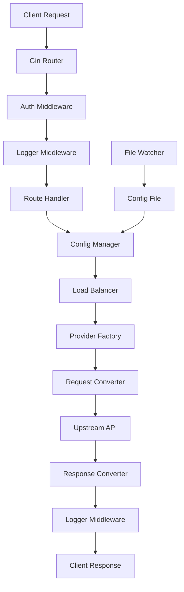

# 项目架构与设计

本文档详细介绍 Claude API 代理服务器的架构设计、技术选型和实现细节。

## 项目结构

### Monorepo 结构

项目采用 Monorepo 架构，由 Bun workspaces 管理，主要包含两个核心模块：

```
claude-proxy/
├── backend-go/              # Go 后端服务 (当前活跃)
│   ├── cmd/                # 主程序入口
│   ├── internal/           # 内部实现
│   │   ├── config/        # 配置管理
│   │   ├── handlers/      # HTTP 处理器
│   │   ├── middleware/    # 中间件
│   │   └── providers/     # 上游服务适配器
│   ├── .config/           # 运行时配置
│   │   ├── config.json    # 主配置文件
│   │   └── backups/       # 配置备份 (保留最近10个)
│   └── .env               # 环境变量
├── frontend/               # Vue 3 前端
│   ├── src/
│   │   ├── components/    # Vue 组件
│   │   ├── services/      # API 服务
│   │   └── styles/        # 样式文件
│   ├── public/            # 静态资源
│   └── dist/              # 构建产物
├── backend/                # Node.js/Bun 后端 (备用实现)
├── scripts/                # 构建和部署脚本
└── docs/                   # 文档 (markdown 文件)
```

### TypeScript 路径别名

项目配置了路径别名，方便跨模块导入：

```typescript
// 示例导入
import { api } from '@frontend/services/api'
import { ConfigManager } from '@backend/config/config-manager'
```

- `@frontend/*` → `frontend/src/*`
- `@backend/*` → `backend/src/*`

## 核心技术栈

### 后端 (backend-go/)

- **运行时**: Go 1.22+
- **框架**: Gin Web Framework
- **配置管理**: fsnotify (热重载) + godotenv
- **前端嵌入**: Go `embed.FS`
- **并发模型**: 原生 Goroutine
- **性能优势**:
  - 启动时间: < 100ms (vs Node.js 2-3s)
  - 内存占用: ~20MB (vs Node.js 50-100MB)
  - 部署包大小: ~15MB (vs Node.js 200MB+)

### 前端 (frontend/)

- **框架**: Vue 3 (Composition API)
- **UI 组件库**: Vuetify 3 + DaisyUI
- **构建工具**: Vite
- **状态管理**: Vue Composition API
- **HTTP 客户端**: Fetch API

### 构建系统

- **包管理器**: Bun (推荐) / npm / pnpm
- **构建工具**: Makefile + Shell Scripts
- **跨平台编译**: 支持 Linux/macOS/Windows, amd64/arm64

## 模块索引

| 模块           | 路径                              | 职责                        |
| -------------- | --------------------------------- | --------------------------- |
| **后端核心**   | `backend-go/`                     | API 代理、协议转换、配置管理 |
| **前端界面**   | `frontend/`                       | Web 管理界面、渠道配置       |
| **提供商适配** | `backend-go/internal/providers/`  | 上游服务协议转换            |
| **配置系统**   | `backend-go/internal/config/`     | 配置文件管理和热重载        |
| **HTTP 处理**  | `backend-go/internal/handlers/`   | REST API 路由和业务逻辑     |
| **中间件**     | `backend-go/internal/middleware/` | 认证、日志、CORS            |

## 设计模式

### 1. 提供商模式 (Provider Pattern)

所有上游 AI 服务都实现统一的 `Provider` 接口，实现协议转换：

```go
type Provider interface {
    // 将 Claude 格式请求转换为上游格式
    ConvertRequest(claudeRequest *ClaudeRequest) (*UpstreamRequest, error)

    // 将上游响应转换为 Claude 格式
    ConvertResponse(upstreamResponse *UpstreamResponse) (*ClaudeResponse, error)

    // 处理流式响应
    StreamResponse(upstream io.Reader, downstream io.Writer) error
}
```

**已实现的提供商**:
- `OpenAI`: 支持 OpenAI API 和兼容 API
- `Gemini`: Google Gemini API
- `Claude`: Anthropic Claude API (直接透传)
- `OpenAI Old`: 旧版 OpenAI API 兼容

### 2. 配置管理器模式

`ConfigManager` 负责配置的生命周期管理：

```go
type ConfigManager struct {
    config     *Config
    configPath string
    watcher    *fsnotify.Watcher
    mu         sync.RWMutex
}

// 核心功能
func (cm *ConfigManager) Load() error
func (cm *ConfigManager) Save() error
func (cm *ConfigManager) Watch() error
func (cm *ConfigManager) GetNextAPIKey(channelID string) (string, error)
```

**特性**:
- 配置文件热重载 (无需重启服务)
- 自动备份机制 (保留最近 10 个版本)
- 线程安全的读写操作
- API 密钥轮询策略

### 3. 中间件模式

Express/Gin 使用中间件架构处理横切关注点：

```go
// 认证中间件
func AuthMiddleware() gin.HandlerFunc

// 日志记录中间件
func LoggerMiddleware() gin.HandlerFunc

// 错误处理中间件
func ErrorHandler() gin.HandlerFunc

// CORS 中间件
func CORSMiddleware() gin.HandlerFunc
```

## 数据流图



**流程说明**:
1. 客户端请求到达 Gin 路由器
2. 通过认证和日志中间件
3. 路由处理器获取配置
4. 负载均衡器选择 API 密钥
5. Provider 工厂创建对应的协议转换器
6. 转换请求格式并发送到上游 API
7. 接收上游响应并转换回 Claude 格式
8. 记录日志并返回给客户端

## 技术选型决策

### 前端资源嵌入方案

#### 实现对比

**当前方案**:
```go
//go:embed frontend/dist/*
var frontendFS embed.FS

func ServeStaticFiles(r *gin.Engine) {
    // API 路由优先处理
    r.NoRoute(func(c *gin.Context) {
        path := c.Request.URL.Path

        // 检测 API 路径
        if isAPIPath(path) {
            c.JSON(404, gin.H{"error": "API endpoint not found"})
            return
        }

        // 尝试读取静态文件
        fileContent, err := fs.ReadFile(distFS, path[1:])
        if err == nil {
            contentType := getContentType(path)
            c.Data(200, contentType, fileContent)
            return
        }

        // SPA 回退到 index.html
        indexContent, _ := fs.ReadFile(distFS, "index.html")
        c.Data(200, "text/html; charset=utf-8", indexContent)
    })
}
```

**关键优势**:
1. ✅ **单次嵌入**: 只嵌入一次整个目录,避免重复
2. ✅ **智能文件检测**: 先尝试读取实际文件
3. ✅ **动态 Content-Type**: 根据扩展名返回正确类型
4. ✅ **API 路由优先**: API 404 返回 JSON 而非 HTML
5. ✅ **简洁代码**: 无需自定义 FileSystem 适配器

#### 缓存策略

**已实施**:
- API 路由返回 JSON 格式 404 错误
- 静态文件正确的 MIME 类型检测

**待优化**:
- HTML 文件: `Cache-Control: no-cache, no-store, must-revalidate`
- 静态资源 (.css, .js, 字体): `Cache-Control: public, max-age=31536000, immutable`

### Go vs TypeScript 重写

v2.0.0 将后端完全重写为 Go 语言:

| 指标            | TypeScript/Bun | Go         | 提升      |
| --------------- | -------------- | ---------- | --------- |
| **启动时间**    | 2-3s           | < 100ms    | **20x**   |
| **内存占用**    | 50-100MB       | ~20MB      | **70%↓**  |
| **部署包大小**  | 200MB+         | ~15MB      | **90%↓**  |
| **并发处理**    | 事件循环       | Goroutine  | 原生并发  |
| **部署依赖**    | Node.js 运行时 | 单二进制   | 零依赖    |

**选择 Go 的原因**:
- 高性能和低资源占用
- 单二进制部署,无需运行时
- 原生并发支持,适合高并发场景
- 强类型系统和出色的工具链

## 性能优化

### 智能构建缓存

Makefile 实现了智能缓存机制:

```makefile
.build-marker: $(shell find frontend/src -type f)
	@echo "检测到前端文件变更,重新构建..."
	cd frontend && npm run build
	@touch .build-marker

ensure-frontend-built: .build-marker
```

**性能对比**:

| 场景               | 之前   | 现在      | 提升       |
| ------------------ | ------ | --------- | ---------- |
| 首次构建           | ~10秒  | ~10秒     | 无变化     |
| **无变更重启**     | ~10秒  | **0.07秒** | **142x** 🚀 |
| 有变更重新构建     | ~10秒  | ~8.5秒    | 15%提升    |

### 请求头优化

针对不同上游使用不同的请求头策略:

- **Claude 渠道**: 保留原始请求头 (支持 `anthropic-version` 等)
- **OpenAI/Gemini 渠道**: 最小化请求头 (仅 `Host` 和 `Content-Type`)

这避免了转发无关头部导致上游 API 拒绝请求的问题。

## 安全设计

### 统一认证架构

所有访问入口受 `PROXY_ACCESS_KEY` 保护:

```go
func AuthMiddleware() gin.HandlerFunc {
    return func(c *gin.Context) {
        // 健康检查无需认证
        if c.Request.URL.Path == "/health" {
            c.Next()
            return
        }

        // 验证访问密钥
        apiKey := c.GetHeader("x-api-key")
        if apiKey != expectedKey {
            c.JSON(401, gin.H{"error": "Unauthorized"})
            c.Abort()
            return
        }

        c.Next()
    }
}
```

**受保护的入口**:
1. 前端管理界面 (`/`)
2. 管理 API (`/api/*`)
3. 代理 API (`/v1/messages`)

**公开入口**:
- 健康检查 (`/health`)

### 敏感信息保护

- API 密钥掩码显示 (仅显示前 8 位和后 4 位)
- 日志中自动隐藏 `Authorization` 头
- 配置文件权限控制 (`.config/` 目录)

## 扩展性

### 添加新的上游服务

1. 在 `internal/providers/` 创建新的 provider 文件
2. 实现 `Provider` 接口
3. 在 `ProviderFactory` 注册新 provider
4. 更新配置文件模式

示例:
```go
// internal/providers/myapi.go
type MyAPIProvider struct{}

func (p *MyAPIProvider) ConvertRequest(req *ClaudeRequest) (*UpstreamRequest, error) {
    // 实现协议转换逻辑
}

// 在 factory 中注册
func GetProvider(providerType string) Provider {
    switch providerType {
    case "myapi":
        return &MyAPIProvider{}
    // ...
    }
}
```

## 文档资源

- **快速开始**: 参见 [README.md](README.md)
- **环境配置**: 参见 [ENVIRONMENT.md](ENVIRONMENT.md)
- **贡献指南**: 参见 [CONTRIBUTING.md](CONTRIBUTING.md)
- **版本历史**: 参见 [CHANGELOG.md](CHANGELOG.md)
