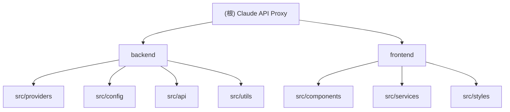

# CLAUDE.md

This file provides guidance to Claude Code (claude.ai/code) when working with code in this repository.

# Claude API 代理服务器架构指南

> 🚀 一个高性能的Claude API代理服务器，支持多种上游AI服务提供商，提供Web管理界面和统一API入口。

## 变更记录 (Changelog)

### 2025-09-20

- 添加API密钥重复检测功能到前端管理界面
- 实现密钥高亮显示和自动清空输入功能
- 更新CLAUDE.md符合Claude Code标准格式

### 2025-08-20

- 创建初始架构文档
- 分析项目整体结构和技术栈
- 确定开发工作流程和部署策略

---

## 项目愿景

本项目是一个现代化的AI API代理服务器，通过统一接口为客户端提供多种上游AI服务商的访问能力。核心目标包括：

- 🔄 **协议转换**: 将Claude格式请求转换为不同上游服务商的格式
- ⚖️ **负载均衡**: 支持多API密钥的智能分配和故障转移
- 🖥️ **可视化管理**: 提供现代化的Web管理界面
- 🛡️ **高可用性**: 实现健康检查、错误处理和优雅降级

## 架构总览

### 模块结构图



### 核心技术栈

**后端 (backend/)**

- **运行时**: Bun + Node.js (兼容)
- **框架**: Express.js + TypeScript
- **协议转换**: 自定义Provider模式
- **配置管理**: 基于文件的热重载配置

**前端 (frontend/)**

- **框架**: Vue 3 + TypeScript
- **UI组件库**: Vuetify 3 + DaisyUI
- **构建工具**: Vite
- **状态管理**: Vue Composition API

## 模块索引

| 模块           | 路径                     | 职责                        | 技术栈               |
| -------------- | ------------------------ | --------------------------- | -------------------- |
| **后端核心**   | `backend/`               | API代理、协议转换、配置管理 | Express + TypeScript |
| **前端界面**   | `frontend/`              | Web管理界面、渠道配置       | Vue 3 + Vuetify      |
| **提供商适配** | `backend/src/providers/` | 上游服务协议转换            | Provider模式         |
| **配置系统**   | `backend/src/config/`    | 配置文件管理和热重载        | 文件监听             |
| **Web API**    | `backend/src/api/`       | REST API路由和业务逻辑      | Express Router       |

## 运行与开发

### 开发环境

```bash
# 安装依赖 (使用Bun以获得最佳性能)
bun install

# 开发模式 (同时启动前后端，支持热重载)
bun run dev

# 仅启动后端
cd backend && bun run dev

# 仅启动前端
cd frontend && bun run dev
```

### 生产环境

```bash
# 构建完整项目
bun run build

# 启动生产服务器 (包含Web界面)
bun run start

# 访问地址:
# - Web管理界面: http://localhost:3000
# - API服务端点: http://localhost:3000/v1/messages
# - 健康检查: http://localhost:3000/health
```

### 配置管理

```bash
# 命令行配置工具
cd backend && bun run config --help

# 添加上游服务
bun run config add openai openai https://api.openai.com/v1

# 添加API密钥
bun run config key openai add sk-your-api-key

# 设置当前使用的上游
bun run config use openai

# 查看当前配置
bun run config show
```

## 测试策略

### 开发测试

```bash
# TypeScript 类型检查
bun run type-check

# 构建验证
bun run build

# 健康检查测试
curl http://localhost:3000/health
```

### API测试

```bash
# 基础对话测试
curl -X POST http://localhost:3000/v1/messages \
  -H "x-api-key: your-proxy-access-key" \
  -H "Content-Type: application/json" \
  -d '{"model":"claude-3-5-sonnet-20241022","max_tokens":100,"messages":[{"role":"user","content":"Hello"}]}'

# 流式响应测试
curl -X POST http://localhost:3000/v1/messages \
  -H "x-api-key: your-proxy-access-key" \
  -H "Content-Type: application/json" \
  -d '{"model":"claude-3-5-sonnet-20241022","stream":true,"max_tokens":100,"messages":[{"role":"user","content":"Count to 10"}]}'
```

### 负载均衡测试

```bash
# 设置轮询策略并测试
bun run config balance round-robin

# 发送多个请求观察密钥轮换
for i in {1..5}; do
  curl -X POST http://localhost:3000/v1/messages \
    -H "x-api-key: your-proxy-access-key" \
    -H "Content-Type: application/json" \
    -d '{"model":"claude-3-5-sonnet-20241022","max_tokens":10,"messages":[{"role":"user","content":"Test '$i'"}]}'
done
```

## 编码规范

### 设计原则

1. **KISS原则**: 保持代码简洁，优先选择直观的解决方案
2. **DRY原则**: 消除重复代码，提取共享函数
3. **函数式编程**: 优先使用`map`、`reduce`、`filter`等方法
4. **Provider模式**: 所有上游服务实现统一接口

### 代码质量标准

- 使用TypeScript严格模式，避免`any`类型
- 所有函数都有明确的类型声明
- 使用正则表达式替代复杂字符串处理
- 实现优雅的错误处理和日志记录

### 文件命名规范

- **文件名**: kebab-case (`config-manager.ts`)
- **类名**: PascalCase (`ConfigManager`)
- **函数名**: camelCase (`getNextApiKey`)
- **常量名**: SCREAMING_SNAKE_CASE (`DEFAULT_CONFIG`)

---

> 💡 **提示**: 本项目遵循Monorepo结构，前后端代码共存但相对独立。开发时建议使用`bun run dev`以获得最佳开发体验。
