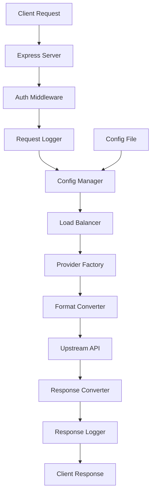

# 开发模式说明

## 开发脚本说明

### 生产环境

```bash
bun start                    # 启动生产服务器
```

### 开发环境

```bash
# 基础开发模式 - Bun自带文件监听
bun run dev:local           # 监听文件变化并重启

# 自动重启模式 - 智能重启（推荐）
bun run dev:auto            # 源码文件变化自动重启

# 热重载模式 - Bun热重载
bun run dev:hot             # 热重载模式
```

## 文件监听策略

### 源码文件（需要重启）

- `src/**/*.ts` - 所有源码文件
- `server.ts` - 主服务器文件
- `dev-runner.ts` - 自动重启脚本

**注意**: `config.json` 已被排除在源码监听之外，不会触发重启

**变化时**: 自动重启服务器或提示手动重启

### 配置文件（无需重启）

- `config.json` - 主配置文件

**变化时**: 自动重载配置，保持服务器运行

### 环境变量文件（需要重启）

- `.env` - 环境变量文件
- `.env.example` - 环境变量示例

**变化时**: 需要重启服务器以加载新的环境变量

## 开发模式特性

### 1. 自动重启 (`dev:auto`)

- ✅ 源码文件变化自动重启
- ✅ 配置文件变化自动重载（不重启）
- ✅ 智能重启控制（最多10次）
- ✅ 优雅关闭处理
- ✅ 详细的开发日志

### 2. 主服务器 (server.ts)

- ✅ 生产/开发环境自适应
- ✅ 开发模式端点和中间件
- ✅ 分离的文件监听
- ✅ 配置自动重载
- ✅ 详细的开发日志

### 3. 配置热重载

- ✅ 配置文件变化自动重载
- ✅ 基于文件的配置管理
- ✅ 手动重载端点
- ✅ 无需重启服务器

## 开发模式端点

### 健康检查

```
GET /health                # 基础健康检查
```

### 开发信息

```
GET /admin/dev/info        # 开发环境信息
```

### 配置重载

```
POST /admin/config/reload  # 手动重载配置
```

## 环境变量

```bash
# 开发环境
NODE_ENV=development                   # 开发模式
```

## 开发工作流

1. **启动开发服务器**

    ```bash
    bun run dev:auto
    ```

2. **修改源码**
    - 服务器会自动重启
    - 保持请求会话

3. **修改配置**
    - 使用 `bun run config` 命令
    - 或直接编辑 `config.json`
    - 配置会自动重载，无需重启

4. **测试**
    - 使用 `/admin/dev/info` 查看状态
    - 使用健康检查端点验证

## 文件变化处理

| 文件类型 | 监听模式 | 处理方式 | 是否重启 |
| -------- | -------- | -------- | -------- |
| 源码文件 | 源码监听 | 自动重启 | ✅ 是    |
| 配置文件 | 配置监听 | 自动重载 | ❌ 否    |
| 环境变量 | 环境监听 | 需要重启 | ✅ 是    |

## 故障排除

### 端口占用

```bash
lsof -i :3000              # 查看端口占用
kill -9 <PID>              # 强制终止进程
```


### 配置重载失败

```bash
# 检查配置文件语法
cat config.json | python -m json.tool

# 手动重载配置
curl -X POST http://localhost:3000/admin/config/reload
```

### 文件监听问题

- 确保没有在node_modules中
- 检查文件权限
- 重启开发服务器

## 最佳实践

1. **开发时使用 `dev:auto`**
2. **生产环境使用 `start`**
3. **配置管理基于文件**
4. **定期检查日志输出**
5. **使用健康检查监控状态**
6. **配置修改无需重启**
7. **源码修改会自动重启**

## 🏗️ 项目架构

### 核心组件

```
claude-worker-proxy/
├── src/
│   ├── provider.ts       # 统一提供商接口
│   ├── openai.ts         # OpenAI 格式转换器
│   ├── gemini.ts         # Gemini 格式转换器
│   ├── claude.ts         # Claude 格式转换器
│   ├── openaiold.ts      # 旧版 OpenAI 格式转换器
│   ├── config.ts         # 配置管理器
│   ├── env.ts            # 环境变量管理
│   ├── utils.ts          # 工具函数
│   └── types.ts          # TypeScript 类型定义
├── server.ts             # Express 服务器（本地/开发）
├── dev-runner.ts         # 开发模式自动重启
├── config-cli.ts         # 配置命令行工具
├── config.json           # 运行时配置文件
└── .env                  # 环境变量配置
```

### 设计模式

#### 1. 提供商模式 (Provider Pattern)

所有上游 AI 服务都实现统一的 `Provider` 接口：

```typescript
interface Provider {
    convertToProviderRequest(request: Request, baseUrl: string, apiKey: string): Promise<Request>
    convertToClaudeResponse(response: Response): Promise<Response>
}
```

#### 2. 配置管理器模式

`ConfigManager` 负责：
- 配置文件的读写
- 配置变更监听
- 基于文件的配置管理
- API 密钥轮询策略

#### 3. 中间件模式

Express 服务器使用中间件架构：
- 身份验证中间件
- 日志记录中间件
- 错误处理中间件
- CORS 中间件

### 数据流图



## 📝 代码规范

### TypeScript 规范

- 使用严格的 TypeScript 配置
- 所有函数和变量都有明确的类型声明
- 使用接口定义数据结构
- 避免使用 `any` 类型

### 命名规范

- **文件名**: kebab-case (例: `config-manager.ts`)
- **类名**: PascalCase (例: `ConfigManager`)
- **函数名**: camelCase (例: `getNextApiKey`)
- **常量名**: SCREAMING_SNAKE_CASE (例: `DEFAULT_CONFIG`)

### 错误处理

- 使用 try-catch 捕获异常
- 提供有意义的错误消息
- 记录错误日志
- 优雅降级处理

```typescript
try {
    const result = await riskyOperation()
    return result
} catch (error) {
    console.error('Operation failed:', error)
    throw new Error('Specific error message for user')
}
```

### 日志规范

使用分级日志系统：

```typescript
console.error('严重错误信息')   // 错误级别
console.warn('警告信息')       // 警告级别
console.log('一般信息')        // 信息级别
console.debug('调试信息')      // 调试级别
```

## 🧪 测试策略

### 手动测试

#### 1. 基础功能测试

```bash
# 测试健康检查
curl http://localhost:3000/health

# 测试基础对话
curl -X POST http://localhost:3000/v1/messages \
  -H "x-api-key: test-key" \
  -H "Content-Type: application/json" \
  -d '{"model":"claude-3-5-sonnet-20241022","max_tokens":100,"messages":[{"role":"user","content":"Hello"}]}'

# 测试流式响应
curl -X POST http://localhost:3000/v1/messages \
  -H "x-api-key: test-key" \
  -H "Content-Type: application/json" \
  -d '{"model":"claude-3-5-sonnet-20241022","stream":true,"max_tokens":100,"messages":[{"role":"user","content":"Count to 10"}]}'
```

#### 2. 负载均衡测试

```bash
# 添加多个 API 密钥
bun run config key test-upstream add key1 key2 key3

# 设置轮询策略
bun run config balance round-robin

# 发送多个请求观察密钥轮换
for i in {1..5}; do
  curl -X POST http://localhost:3000/v1/messages \
    -H "x-api-key: test-key" \
    -H "Content-Type: application/json" \
    -d '{"model":"claude-3-5-sonnet-20241022","max_tokens":10,"messages":[{"role":"user","content":"Test '$i'"}]}'
done
```


### 集成测试

#### Claude Code 集成测试

1. 配置 Claude Code 使用本地代理
2. 测试基础对话功能
3. 测试工具调用功能
4. 测试流式响应
5. 验证错误处理

#### 压力测试

```bash
# 使用 ab (Apache Bench) 进行压力测试
ab -n 100 -c 10 -p request.json -T application/json \
  -H "x-api-key: test-key" \
  http://localhost:3000/v1/messages
```

## 🔧 调试技巧

### 1. 日志分析

```bash
# 实时查看日志
tail -f server.log

# 过滤错误日志
grep -i "error" server.log

# 分析请求模式
grep -o "POST /v1/messages" server.log | wc -l
```

### 2. 配置调试

```bash
# 验证配置文件
cat config.json | jq .

# 检查环境变量
env | grep -E "(PORT|LOG_LEVEL)"
```

### 3. 网络调试

```bash
# 测试上游连接
curl -I https://api.openai.com

# 检查 DNS 解析
nslookup api.openai.com

# 测试端口连通性
telnet localhost 3000
```

## 🚀 部署指南

### 开发环境部署

```bash
# 1. 安装依赖
pnpm install

# 2. 配置环境变量
cp .env.example .env
vim .env

# 3. 启动开发服务器
bun run dev:auto
```

### 生产环境部署

```bash
# 1. 构建项目
pnpm install --production

# 2. 配置环境变量
export NODE_ENV=production
export PORT=3000
# 3. 启动服务器
bun run start

# 4. 设置进程管理 (推荐 PM2)
pm2 start server.ts --name claude-proxy
pm2 save
pm2 startup
```


### Docker 部署

```dockerfile
FROM oven/bun:1 as base
WORKDIR /app

COPY package.json bun.lock ./
RUN bun install --frozen-lockfile

COPY . .

EXPOSE 3000
CMD ["bun", "run", "start"]
```

```bash
# 构建和运行
docker build -t claude-proxy .
docker run -p 3000:3000 -e NODE_ENV=production claude-proxy
```
