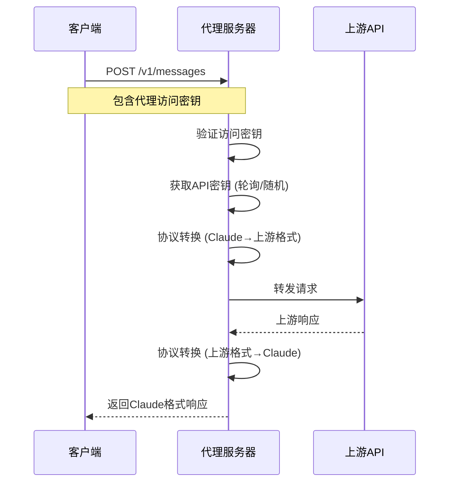

# Claude API 代理服务器

一个高性能的 Claude API 代理服务器，支持多种上游 AI 服务提供商（OpenAI、Gemini、自定义 API），提供负载均衡、多 API 密钥管理和统一入口访问。

## 🚀 功能特性

- **统一入口**: 所有请求通过单一端点 `http://localhost:3000/v1/messages` 访问
- **多上游支持**: 支持 OpenAI、Gemini、自定义 API 服务商
- **负载均衡**: 支持轮询、随机、故障转移策略
- **多 API 密钥**: 每个上游可配置多个 API 密钥，自动轮换使用
- **配置管理**: 命令行工具轻松管理上游配置
- **环境变量**: 通过 `.env` 文件灵活配置服务器参数
- **健康检查**: 内置健康检查端点
- **日志系统**: 完整的请求/响应日志记录
- **🔄 兼容 Claude Code**: 配合 [One-Balance](https://github.com/glidea/one-balance) 低成本使用 Claude Code
- **📡 支持流式和非流式响应**
- **🛠️ 支持工具调用**

## 📦 安装

### 前置要求

- Node.js 18+ 或 Bun
- pnpm 包管理器

### 安装步骤

1. 克隆项目

```bash
git clone https://github.com/glidea/claude-worker-proxy
cd claude-worker-proxy
```

2. 安装依赖

```bash
pnpm install
```

3. 配置环境变量

```bash
cp .env.example .env
# 编辑 .env 文件，设置你的配置
```

4. 启动服务器

```bash
# 生产环境
pnpm start

# 开发环境（热重载）
pnpm dev:local
```

## ⚙️ 配置

### 代理访问密钥配置

代理服务器需要一个访问密钥来验证客户端请求。这个密钥通过环境变量 `PROXY_ACCESS_KEY` 配置：

```env
PROXY_ACCESS_KEY=your-proxy-access-key
```

**密钥说明**：

- **代理访问密钥**: 在 `.env` 文件中配置，用于验证客户端对代理服务器的访问权限
- **上游 API 密钥**: 通过 `bun run config key` 命令配置，用于代理服务器访问上游 AI 服务商

### 环境变量配置

创建 `.env` 文件（参考 `.env.example`）：

```env
# 服务器配置
PORT=3000
NODE_ENV=development

# 代理访问密钥 - 用于验证客户端对代理服务器的访问权限
PROXY_ACCESS_KEY=your-proxy-access-key

# 负载均衡策略 (round-robin, random, failover)
LOAD_BALANCE_STRATEGY=failover

# 日志级别 (error, warn, info, debug)
LOG_LEVEL=debug

# 是否启用请求/响应日志
ENABLE_REQUEST_LOGS=true
ENABLE_RESPONSE_LOGS=true

# 请求超时时间（毫秒）
REQUEST_TIMEOUT=30000

# 最大并发请求数
MAX_CONCURRENT_REQUESTS=100

# CORS配置
ENABLE_CORS=true
CORS_ORIGIN=*

# 安全配置
ENABLE_RATE_LIMIT=false
RATE_LIMIT_WINDOW=60000
RATE_LIMIT_MAX_REQUESTS=100

# 健康检查配置
HEALTH_CHECK_ENABLED=true
HEALTH_CHECK_PATH=/health
```

### 上游配置管理

使用命令行工具管理上游配置：

```bash
# 添加上游
bun run config add <name> <baseUrl> <serviceType>

# 示例
bun run config add openai-api https://api.openai.com openai
bun run config add gemini-api https://generativelanguage.googleapis.com gemini
bun run config add custom-api https://your-api.com custom

# 添加 API 密钥
bun run config key <upstream-name> add <apiKey1> <apiKey2> ...

# 列出 API 密钥（输出已脱敏）
bun run config key <index> list

# 示例
bun run config key openai-api add sk-1234567890abcdef sk-0987654321fedcba

# 查看当前配置
bun run config show

# 删除上游
bun run config remove <upstream-name>

# 设置负载均衡策略
bun run config balance <strategy>

# 清除所有配置
bun run config clear
```

### 🔧 详细配置示例

#### 1. OpenAI 配置

```bash
# 添加 OpenAI 上游
bun run config add openai-main https://api.openai.com openai

# 添加多个 API 密钥（支持负载均衡）
bun run config key openai-main add \
  sk-proj-abc123def456... \
  sk-proj-xyz789uvw456...

# 设置为当前使用的上游
bun run config use openai-main
```

#### 2. Gemini 配置

```bash
# 添加 Gemini 上游
bun run config add gemini-main https://generativelanguage.googleapis.com/v1beta gemini

# 添加 Gemini API 密钥
bun run config key gemini-main add AIzaSyC1234567890abcdef...

# 切换到 Gemini
bun run config use gemini-main
```

#### 3. 第三方 API 服务配置

```bash
# 添加第三方 Claude 兼容 API
bun run config add anthropic-proxy https://api.your-provider.com openai

# 添加 API 密钥
bun run config key anthropic-proxy add your-api-key-here

# 切换到第三方服务
bun run config use anthropic-proxy
```

#### 4. 多渠道配置与切换

```bash
# 配置多个上游服务
bun run config add openai-primary https://api.openai.com openai
bun run config add openai-backup https://api.openai.com openai
bun run config add gemini-backup https://generativelanguage.googleapis.com/v1beta gemini

# 为每个上游添加密钥
bun run config key openai-primary add sk-primary-key...
bun run config key openai-backup add sk-backup-key...
bun run config key gemini-backup add AIza-backup-key...

# 查看所有配置
bun run config show

# 根据需要切换上游
bun run config use openai-primary    # 使用主要 OpenAI
bun run config use gemini-backup     # 切换到备用 Gemini
```

### 配置文件格式

配置存储在 `config.json` 中：

```json
{
    "upstream": [
        {
            "baseUrl": "https://api.openai.com",
            "apiKeys": ["sk-1234567890abcdef", "sk-0987654321fedcba"],
            "serviceType": "openai",
            "name": "openai-api"
        },
        {
            "baseUrl": "https://generativelanguage.googleapis.com",
            "apiKeys": ["your-gemini-api-key"],
            "serviceType": "gemini",
            "name": "gemini-api"
        }
    ],
    "currentUpstream": 0,
    "loadBalance": "failover"
}
```

## 🔧 API 使用

### 统一入口端点

```
POST http://localhost:3000/v1/messages
```

### 请求头

需要在请求头中包含代理服务器的访问密钥：

```bash
x-api-key: your-proxy-access-key
```

### 🏗️ 工作原理



### 📋 支持的模型

| 模型类型 | 示例模型ID | 支持的服务商 |
|---------|-----------|-------------|
| Claude 3.5 Sonnet | `claude-3-5-sonnet-20241022` | OpenAI, 自定义API |
| Claude 3.5 Haiku | `claude-3-5-haiku-20241022` | OpenAI, 自定义API |
| Claude 3 Opus | `claude-3-opus-20240229` | OpenAI, 自定义API |
| Gemini | `gemini-1.5-pro` | Gemini |

### 请求格式

#### 基础文本对话

```json
{
    "model": "claude-3-5-sonnet-20241022",
    "max_tokens": 1000,
    "messages": [
        {
            "role": "user",
            "content": "Hello, how are you?"
        }
    ]
}
```

#### 流式响应

```json
{
    "model": "claude-3-5-sonnet-20241022",
    "max_tokens": 1000,
    "stream": true,
    "messages": [
        {
            "role": "user",
            "content": "Tell me a story"
        }
    ]
}
```

#### 工具调用

```json
{
    "model": "claude-3-5-sonnet-20241022",
    "max_tokens": 1000,
    "tools": [
        {
            "type": "function",
            "function": {
                "name": "get_weather",
                "description": "Get weather information",
                "parameters": {
                    "type": "object",
                    "properties": {
                        "location": {
                            "type": "string",
                            "description": "The city name"
                        }
                    }
                }
            }
        }
    ],
    "messages": [
        {
            "role": "user",
            "content": "What's the weather like in Shanghai?"
        }
    ]
}
```

### 响应格式

#### 标准响应

```json
{
    "id": "msg_123456789",
    "type": "message",
    "role": "assistant",
    "content": [
        {
            "type": "text",
            "text": "I'm doing well, thank you for asking!"
        }
    ],
    "model": "claude-3-5-sonnet-20241022",
    "stop_reason": "end_turn",
    "stop_sequence": null,
    "usage": {
        "input_tokens": 15,
        "output_tokens": 12
    }
}
```

#### 流式响应

```json
data: {"type":"message_start","message":{"id":"msg_123","type":"message","role":"assistant","content":[],"model":"claude-3-5-sonnet-20241022","stop_reason":null,"stop_sequence":null,"usage":{"input_tokens":15,"output_tokens":0}}}

data: {"type":"content_block_start","index":0,"content_block":{"type":"text","text":""}}

data: {"type":"content_block_delta","index":0,"delta":{"type":"text_delta","text":"Hello"}}

data: {"type":"content_block_delta","index":0,"delta":{"type":"text_delta","text":"!"}}

data: {"type":"content_block_stop","index":0}

data: {"type":"message_delta","delta":{"stop_reason":"end_turn","usage":{"output_tokens":1}}}

data: {"type":"message_stop"}
```

### 实际使用示例

#### cURL 示例

```bash
# 基础对话
curl -X POST http://localhost:3000/v1/messages \
  -H "x-api-key: your-proxy-access-key" \
  -H "Content-Type: application/json" \
  -d '{
    "model": "claude-3-5-sonnet-20241022",
    "max_tokens": 100,
    "messages": [
      {
        "role": "user",
        "content": "Hello, how are you?"
      }
    ]
  }'

# 流式响应
curl -X POST http://localhost:3000/v1/messages \
  -H "x-api-key: your-proxy-access-key" \
  -H "Content-Type: application/json" \
  -d '{
    "model": "claude-3-5-sonnet-20241022",
    "max_tokens": 100,
    "stream": true,
    "messages": [
      {
        "role": "user",
        "content": "Tell me a short story"
      }
    ]
  }'
```

#### Python 示例

```python
import requests
import json

# 配置
base_url = "http://localhost:3000"
api_key = "your-proxy-access-key"

# 发送请求
response = requests.post(
    f"{base_url}/v1/messages",
    headers={
        "x-api-key": api_key,
        "Content-Type": "application/json"
    },
    json={
        "model": "claude-3-5-sonnet-20241022",
        "max_tokens": 1000,
        "messages": [
            {
                "role": "user",
                "content": "Explain quantum computing in simple terms"
            }
        ]
    }
)

print(response.json())
```

#### JavaScript 示例

```javascript
// 使用 fetch API
async function sendMessage(content) {
    const response = await fetch('http://localhost:3000/v1/messages', {
        method: 'POST',
        headers: {
            'x-api-key': 'your-proxy-access-key',
            'Content-Type': 'application/json'
        },
        body: JSON.stringify({
            model: 'claude-3-5-sonnet-20241022',
            max_tokens: 1000,
            messages: [
                {
                    role: 'user',
                    content: content
                }
            ]
        })
    });
    
    const data = await response.json();
    return data;
}

// 使用示例
sendMessage("What is the meaning of life?")
    .then(response => console.log(response))
    .catch(error => console.error(error));
```

## 🏥 健康检查

健康检查端点：

```
GET http://localhost:3000/health
```

响应示例：

```json
{
    "status": "healthy",
    "timestamp": "2024-01-01T00:00:00.000Z",
    "uptime": 120.5,
    "config": {
        "upstreamCount": 2,
        "currentUpstream": "openai-api",
        "loadBalance": "failover"
    }
}
```

## 📊 监控和日志

### 日志级别

- `error`: 仅错误日志
- `warn`: 警告和错误日志
- `info`: 一般信息、警告和错误日志
- `debug`: 所有日志（包括调试信息）

### 日志输出

服务器会输出详细的运行日志：

```
🚀 Claude API代理服务器已启动
📍 本地地址: http://localhost:3000
📋 统一入口: POST /v1/messages
💚 健康检查: GET /health
⚙️  当前配置: openai-api - https://api.openai.com
🔧 使用 'bun run config --help' 查看配置选项
📊 环境: development
🔍 开发模式 - 详细日志已启用
```

## 🔄 负载均衡策略

负载均衡策略应用于**当前选定上游内的多个 API 密钥**，而不是在多个上游之间切换。你可以通过 `bun run config use <index>` 来选择要使用的上游。

### 1. 轮询 (round-robin)

按顺序轮流使用当前上游配置的每个 API 密钥。

### 2. 随机 (random)

在当前上游配置的 API 密钥中随机选择一个使用。

### 3. 故障转移 (failover)

总是优先使用当前上游配置的第一个 API 密钥。这种策略适用于主备密钥场景。

## 🛡️ 安全特性

- API 密钥安全存储和管理
- CORS 跨域请求控制
- 请求频率限制（可选）
- 请求超时保护
- 错误处理和日志记录

## 🚀 部署

### 本地开发

```bash
# 开发模式（热重载）
pnpm dev:local

# 生产模式
pnpm start
```

### Cloudflare Workers 部署

```bash
# 部署到 Cloudflare Workers
pnpm deploycf
```

## 在 Claude Code 中使用

配置 Claude Code 使用本地代理：

```bash
# 编辑 ~/.claude/settings.json
{
  "env": {
    "ANTHROPIC_BASE_URL": "http://localhost:3000",
    "ANTHROPIC_CUSTOM_HEADERS": "x-api-key: your-proxy-access-key",
    "ANTHROPIC_MODEL": "claude-3-5-sonnet-20241022",
    "ANTHROPIC_SMALL_FAST_MODEL": "claude-3-haiku-20240307",
    "API_TIMEOUT_MS": "600000"
  }
}

claude
```

> **重要说明**: `your-proxy-access-key` 是你访问代理服务器的授权密钥，不是上游服务商的 API key。这个 key 用于验证你对代理服务器的访问权限。

## ❓ 常见问题解答 (FAQ)

### Q1: 代理服务器支持哪些上游 AI 服务商？

**A:** 目前支持以下服务商：
- **OpenAI**: 使用 OpenAI 格式的 API（如 OpenAI 官方、各种第三方 OpenAI 兼容服务）
- **Gemini**: Google 的 Gemini API
- **Claude**: Anthropic 的官方 Claude API
- **自定义 API**: 任何兼容 OpenAI 格式的第三方 API

### Q2: 如何实现 API 密钥的负载均衡？

**A:** 代理服务器支持三种负载均衡策略：

1. **轮询 (round-robin)**: 按顺序轮流使用每个 API 密钥
2. **随机 (random)**: 随机选择一个 API 密钥
3. **故障转移 (failover)**: 总是优先使用第一个密钥

```bash
# 设置负载均衡策略
bun run config balance round-robin
```

### Q3: 可以同时配置多个上游服务商吗？

**A:** 可以！你可以配置多个上游，但同时只能使用一个。通过以下命令切换：

```bash
# 查看所有上游
bun run config show

# 按索引切换
bun run config use 0

# 按名称切换
bun run config use openai-main
```

### Q4: 系统是否需要外部依赖？

**A:** 不需要。系统已经简化，移除了Redis依赖：
- **API密钥轮询**: 使用内存计数器实现
- **配置管理**: 基于本地文件，支持热重载
- **部署简单**: 无需配置外部数据库或缓存

### Q5: 如何在 Claude Code 中使用这个代理？

**A:** 修改 Claude Code 的配置文件 `~/.claude/settings.json`：

```json
{
  "env": {
    "ANTHROPIC_BASE_URL": "http://localhost:3000",
    "ANTHROPIC_CUSTOM_HEADERS": "x-api-key: your-proxy-access-key",
    "ANTHROPIC_MODEL": "claude-3-5-sonnet-20241022"
  }
}
```

### Q6: 支持流式响应吗？

**A:** 完全支持！在请求中添加 `"stream": true` 即可：

```json
{
    "model": "claude-3-5-sonnet-20241022",
    "stream": true,
    "messages": [...]
}
```

### Q7: 如何监控代理服务器的状态？

**A:** 使用健康检查端点：

```bash
curl http://localhost:3000/health
```

开发模式下还有额外的监控端点：

```bash
# 开发环境信息
curl http://localhost:3000/admin/dev/info

# 重载配置
curl -X POST http://localhost:3000/admin/config/reload
```

## 🐛 故障排除

### 启动问题

#### 1. 端口被占用

**现象**: `Error: listen EADDRINUSE: address already in use :::3000`

**解决方案**:
```bash
# 查看端口占用
lsof -i :3000

# 强制终止进程
kill -9 <PID>

# 或修改端口
echo "PORT=3001" >> .env
```

#### 2. 配置文件损坏

**现象**: `SyntaxError: Unexpected token in JSON`

**解决方案**:
```bash
# 检查配置文件语法
cat config.json | python -m json.tool

# 重新生成配置文件
rm config.json
bun run config show
```

### API 调用问题

#### 1. 401 Unauthorized

**可能原因**:
- 代理访问密钥错误
- 上游 API 密钥无效

**解决方案**:
```bash
# 检查代理访问密钥
echo $PROXY_ACCESS_KEY

# 检查上游 API 密钥
bun run config show

# 测试上游 API 密钥
curl -H "Authorization: Bearer sk-your-key" https://api.openai.com/v1/models
```

#### 2. 429 Too Many Requests

**可能原因**:
- API 密钥配额不足
- 请求频率过高

**解决方案**:
```bash
# 添加更多 API 密钥
bun run config key your-upstream add sk-new-key

# 修改负载均衡策略
bun run config balance round-robin
```

#### 3. 500 Internal Server Error

**可能原因**:
- 上游服务不可用
- 配置错误

**解决方案**:
```bash
# 检查服务器日志
tail -f server.log

# 启用调试模式
echo "LOG_LEVEL=debug" >> .env
echo "ENABLE_REQUEST_LOGS=true" >> .env
echo "ENABLE_RESPONSE_LOGS=true" >> .env

# 重启服务器
bun run start
```

### 性能问题

#### 1. 响应缓慢

**解决方案**:
```bash
# 增加并发数
echo "MAX_CONCURRENT_REQUESTS=200" >> .env

# 减少超时时间
echo "REQUEST_TIMEOUT=15000" >> .env

# 使用更近的上游服务
bun run config show
```

#### 2. 内存使用过高

**解决方案**:
```bash
# 减少日志级别
echo "LOG_LEVEL=error" >> .env
echo "ENABLE_REQUEST_LOGS=false" >> .env
echo "ENABLE_RESPONSE_LOGS=false" >> .env

# 重启服务器
bun run start
```

### 调试技巧

#### 1. 启用详细日志

```bash
# 在 .env 文件中设置
LOG_LEVEL=debug
ENABLE_REQUEST_LOGS=true
ENABLE_RESPONSE_LOGS=true
```

#### 2. 使用健康检查

```bash
# 基础健康检查
curl http://localhost:3000/health

# 开发模式信息
curl http://localhost:3000/admin/dev/info
```

#### 3. 手动测试上游 API

```bash
# 测试 OpenAI API
curl -X POST https://api.openai.com/v1/chat/completions \
  -H "Authorization: Bearer sk-your-key" \
  -H "Content-Type: application/json" \
  -d '{"model":"gpt-3.5-turbo","messages":[{"role":"user","content":"Hello"}]}'

# 测试 Gemini API
curl -X POST https://generativelanguage.googleapis.com/v1beta/models/gemini-pro:generateContent?key=your-key \
  -H "Content-Type: application/json" \
  -d '{"contents":[{"parts":[{"text":"Hello"}]}]}'
```

#### 4. 配置验证

```bash
# 查看完整配置
bun run config show

# 验证配置文件格式
cat config.json | jq .
```

## 📝 许可证

MIT License

## 🤝 贡献

欢迎提交 Issue 和 Pull Request！

## 📞 支持

如有问题，请查看故障排除部分或提交 Issue。
