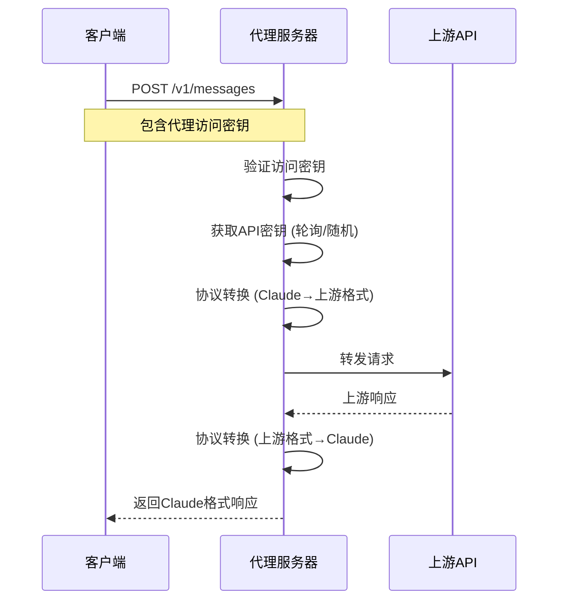

# Claude API 代理服务器

一个高性能的 Claude API 代理服务器，支持多种上游 AI 服务提供商（OpenAI、Gemini、自定义 API），提供负载均衡、多 API 密钥管理和统一入口访问。

## 🚀 功能特性

- **🖥️ Web 管理面板**: 现代化可视化界面，支持渠道管理、实时监控和配置
- **统一入口**: 所有请求通过单一端点 `http://localhost:3000/v1/messages` 访问
- **多上游支持**: 支持 OpenAI (及兼容 API)、Gemini 和 Claude 等多种上游服务
- **负载均衡**: 支持轮询、随机、故障转移策略
- **多 API 密钥**: 每个上游可配置多个 API 密钥，自动轮换使用
- **自动重试与密钥降级**: 检测到额度/余额不足等错误时自动切换下一个可用密钥；若后续请求成功，再将失败密钥移动到末尾（降级）；所有密钥均失败时按上游原始错误返回
- **双重配置**: 支持命令行工具和 Web 界面管理上游配置
- **环境变量**: 通过 `.env` 文件灵活配置服务器参数
- **健康检查**: 内置健康检查端点和实时状态监控
- **日志系统**: 完整的请求/响应日志记录
- **📡 支持流式和非流式响应**
- **🛠️ 支持工具调用**

## 🏁 快速开始

### 前置要求

- Node.js 18+ 或 Bun
- 包管理器：支持 pnpm、npm 或 bun

### 安装步骤

1. 克隆项目

```bash
git clone https://github.com/BenedictKing/claude-proxy
cd claude-proxy
```

2. 安装依赖

```bash
bun install
```

3. 配置环境变量

```bash
cp .env.example .env
# 编辑 .env 文件，设置你的配置
```

4. 启动服务器

```bash
# 开发环境 (同时启动后端API和前端Web界面)
bun run dev

# 仅启动后端API服务
cd backend && bun run dev

# 仅启动前端Web界面
cd frontend && bun run dev

# 生产环境 (包含Web界面)
bun run build && bun run start

# 构建项目 (验证代码)
bun run build

# 类型检查
bun run type-check
```

5. 访问界面

开发环境启动后，你可以通过以下方式访问：

- **Web 管理界面**: http://localhost:5173 （推荐使用，图形化管理）
- **API 服务**: http://localhost:3000 （用于客户端接入）
- **健康检查**: http://localhost:3000/health

6. 配置客户端 (以 Claude Code 为例)

现在代理服务器已在本地运行，您需要配置您的客户端来使用它。

编辑 `~/.claude/settings.json` 文件：

```json
{
  "env": {
    "ANTHROPIC_BASE_URL": "http://localhost:3000",
    "ANTHROPIC_AUTH_TOKEN": "your-proxy-access-key",
    "DISABLE_TELEMETRY": "1",
    "DISABLE_ERROR_REPORTING": "1",
    "CLAUDE_CODE_DISABLE_NONESSENTIAL_TRAFFIC": "1"
  }
}
```

> **重要说明**: `your-proxy-access-key` 是您在 `.env` 文件中设置的 `PROXY_ACCESS_KEY`，用于验证您对代理服务器的访问权限，并非上游服务商的 API key。

## ⚙️ 配置

### 代理访问密钥配置

代理服务器需要一个访问密钥来验证客户端请求。这个密钥通过环境变量 `PROXY_ACCESS_KEY` 配置：

```env
PROXY_ACCESS_KEY=your-proxy-access-key
```

**密钥说明**：

- **代理访问密钥**: 在 `.env` 文件中配置，用于验证客户端对代理服务器的访问权限
- **上游 API 密钥**: 通过 `bun run config key` 命令配置，用于代理服务器访问上游 AI 服务商

### 环境变量配置

创建 `.env` 文件（参考 `.env.example`）：

```env
# 服务器配置
PORT=3000
NODE_ENV=development

# 代理访问密钥 - 用于验证客户端对代理服务器的访问权限
PROXY_ACCESS_KEY=your-proxy-access-key

# 负载均衡策略 (round-robin, random, failover)
LOAD_BALANCE_STRATEGY=failover

# 日志级别 (error, warn, info, debug)
LOG_LEVEL=debug

# 是否启用请求/响应日志
ENABLE_REQUEST_LOGS=true
ENABLE_RESPONSE_LOGS=true

# 请求超时时间（毫秒）
REQUEST_TIMEOUT=30000

# 最大并发请求数
MAX_CONCURRENT_REQUESTS=100

# CORS配置
ENABLE_CORS=true
CORS_ORIGIN=*

# 安全配置
ENABLE_RATE_LIMIT=false
RATE_LIMIT_WINDOW=60000
RATE_LIMIT_MAX_REQUESTS=100

# 健康检查配置
HEALTH_CHECK_ENABLED=true
HEALTH_CHECK_PATH=/health
```

### 上游配置管理

使用命令行工具管理上游配置：

```bash
# 添加上游
bun run config add <name> <type> <url>

# 示例
bun run config add openai-api openai https://api.openai.com/v1
bun run config add gemini-api gemini https://generativelanguage.googleapis.com/v1beta
bun run config add claude-api claude https://api.anthropic.com/v1

# 添加 API 密钥 (支持索引或名称，一次添加一个)
bun run config key <index|name> add <apiKey>

# 列出 API 密钥（输出已脱敏）
bun run config key <index|name> list

# 示例
bun run config key openai-api add sk-1234567890abcdef
bun run config key openai-api add sk-0987654321fedcba

# 查看当前配置
bun run config show

# 删除上游 (支持索引或名称)
bun run config remove <index|name>

# 设置负载均衡策略
bun run config balance <strategy>

# 开启/关闭跳过TLS证书验证（用于处理证书问题）
bun run config update <index|name> --insecureSkipVerify <true|false>
```

### 🔧 详细配置示例

#### 1. OpenAI 配置

```bash
# 添加 OpenAI 上游
bun run config add openai-main https://api.openai.com openai

# 添加多个 API 密钥（支持负载均衡）
bun run config key openai-main add \
  sk-proj-abc123def456... \
  sk-proj-xyz789uvw456...

# 设置为当前使用的上游
bun run config use openai-main
```

#### 2. Gemini 配置

```bash
# 添加 Gemini 上游
bun run config add gemini-main https://generativelanguage.googleapis.com/v1beta gemini

# 添加 Gemini API 密钥
bun run config key gemini-main add AIzaSyC1234567890abcdef...

# 切换到 Gemini
bun run config use gemini-main
```

#### 3. Claude 配置

```bash
# 添加 Claude 官方上游
bun run config add claude-main https://api.anthropic.com/v1 claude

# 添加 API 密钥
bun run config key claude-main add sk-ant-your-api-key...

# 切换到 Claude
bun run config use claude-main
```

#### 4. 第三方 API 服务配置

```bash
# 添加第三方 Claude 兼容 API
bun run config add anthropic-proxy https://api.your-provider.com openai

# 添加 API 密钥
bun run config key anthropic-proxy add your-api-key-here

# 切换到第三方服务
bun run config use anthropic-proxy
```

#### 4. 多渠道配置与切换

```bash
# 配置多个上游服务
bun run config add openai-primary https://api.openai.com openai
bun run config add openai-backup https://api.openai.com openai
bun run config add gemini-backup https://generativelanguage.googleapis.com/v1beta gemini

# 为每个上游添加密钥
bun run config key openai-primary add sk-primary-key...
bun run config key openai-backup add sk-backup-key...
bun run config key gemini-backup add AIza-backup-key...

# 查看所有配置
bun run config show

# 根据需要切换上游
bun run config use openai-primary    # 使用主要 OpenAI
bun run config use gemini-backup     # 切换到备用 Gemini
```

### 配置文件格式

配置存储在 `backend/.config/config.json` 中：

```json
{
  "upstream": [
    {
      "baseUrl": "https://api.openai.com",
      "apiKeys": ["sk-1234567890abcdef", "sk-0987654321fedcba"],
      "serviceType": "openai",
      "name": "openai-api"
    },
    {
      "baseUrl": "https://generativelanguage.googleapis.com",
      "apiKeys": ["your-gemini-api-key"],
      "serviceType": "gemini",
      "name": "gemini-api"
    }
  ],
  "currentUpstream": 0,
  "loadBalance": "failover"
}
```

#### 配置备份与恢复

- 每次写入 `config.json` 之前，系统会自动在 `backend/.config/config.backups/` 目录创建带时间戳的备份，并只保留最近 10 个。
- 如需恢复，可从 `backend/.config/config.backups/` 选择一个备份文件覆盖 `backend/.config/config.json` 后重载配置或重启服务。

## 🖥️ Web 管理面板

项目提供了一个现代化的 Web 管理界面，让您可以通过可视化方式管理渠道配置，无需使用命令行工具。

### 功能特性

- **📊 渠道管理**: 可视化创建、编辑、删除渠道配置
- **🔧 实时配置**: 支持实时添加/删除 API 密钥
- **📈 健康监控**: 实时查看渠道状态和延迟信息
- **🎨 现代界面**: 基于 Vue 3 + Vuetify 的响应式设计
- **🔄 负载均衡**: 可视化设置负载均衡策略
- **🔍 延迟测试**: 一键测试渠道连接延迟
- **📱 响应式布局**: 支持桌面和移动设备访问

### 启动 Web 界面

在项目根目录下运行：

```bash
# 启动后端服务器和前端开发服务器
bun run dev

# 或分别启动
bun run backend:dev  # 后端服务器 (端口: 3000)
bun run frontend:dev # 前端服务器 (端口: 5173)
```

### 访问地址

- **前端管理界面**: http://localhost:5173
- **后端 API 服务**: http://localhost:3000

### Web 界面使用指南

#### 1. 渠道管理

**添加新渠道**：
1. 点击页面右上角的"添加渠道"按钮
2. 填写渠道信息：
   - **渠道名称**: 自定义渠道名称
   - **服务类型**: 选择 OpenAI、Gemini、Claude 等
   - **基础 URL**: 上游服务的 API 地址
   - **描述**: 可选的渠道描述
   - **模型映射**: 可选的模型名称映射关系
3. 添加 API 密钥
4. 点击"保存"完成创建

**编辑渠道**：
- 点击渠道卡片中的"编辑"按钮
- 修改渠道信息并保存

**删除渠道**：
- 点击渠道卡片中的"删除"按钮
- 确认删除操作

#### 2. API 密钥管理

每个渠道支持配置多个 API 密钥以实现负载均衡：

- **添加密钥**: 展开渠道卡片中的"API密钥管理"面板，点击"+"按钮
- **删除密钥**: 点击密钥右侧的删除按钮
- **查看密钥**: 出于安全考虑，界面中显示的是脱敏后的密钥

#### 3. 渠道切换

- 点击任意渠道卡片中的"设为当前"按钮
- 当前激活的渠道会有绿色边框和"当前"标签

#### 4. 延迟测试

- **单个测试**: 点击渠道卡片中的"测试延迟"按钮
- **批量测试**: 点击页面顶部的"测试所有渠道"按钮
- 测试结果会显示在渠道卡片的延迟指示器中

#### 5. 负载均衡配置

在页面顶部的设置区域可以选择负载均衡策略：
- **轮询 (round-robin)**: 按顺序轮流使用 API 密钥
- **随机 (random)**: 随机选择 API 密钥
- **故障转移 (failover)**: 优先使用第一个密钥

### 界面布局

界面采用响应式设计，支持不同屏幕尺寸：

- **小屏幕 (<960px)**: 单列布局
- **中等屏幕 (960px-1280px)**: 双列布局
- **大屏幕 (≥1280px)**: 三列布局，每个渠道卡片最大宽度 550px

### 生产环境部署

#### 构建前端资源

```bash
# 构建前端生产版本
cd frontend
bun run build

# 生成的静态文件位于 frontend/dist 目录
```

#### 集成部署

后端服务器会自动提供前端静态文件服务：

```bash
# 构建完整项目
bun run build

# 启动生产服务器（会同时提供 API 和 Web 界面）
bun run start

# Web 界面访问地址: http://localhost:3000
```

### 开发环境

如需修改前端界面，可以启动开发模式：

```bash
# 前端开发服务器（支持热重载）
cd frontend
bun run dev

# 在另一个终端启动后端
cd backend  
bun run dev
```

## 🚀 部署指南

项目支持多种部署方式，包括包含 Web 管理界面的完整部署。

### 快速部署 (推荐)

```bash
# 1. 构建完整项目 (包括前端和后端)
bun run build

# 2. 启动生产服务器
bun run start

# 访问地址:
# - Web 管理界面: http://localhost:3000
# - API 服务: http://localhost:3000/v1/messages
```

### 生产环境 (使用 PM2)

PM2 是一个带有负载均衡器的 Node.js 生产流程管理器，可以帮助您保持应用7x24小时在线。

```bash
# 1. 全局安装 PM2 (如果尚未安装)
npm install -g pm2

# 2. 使用 PM2 启动应用
# 这会使用 bun 来执行 start 脚本
pm2 start bun --name "claude-proxy" -- run start

# 3. 将应用列表保存到硬盘
pm2 save

# 4. 生成并配置启动脚本，使应用在服务器重启后自动启动
pm2 startup
```

### Docker 部署

使用 Docker 可以更方便地部署包含 Web 界面的完整应用。

1.  **在项目根目录创建 `Dockerfile`**

    ```dockerfile
    FROM oven/bun:1

    WORKDIR /app

    # 仅复制必要的文件
    COPY package.json bun.lockb ./
    COPY frontend/package.json ./frontend/
    COPY backend/package.json ./backend/

    # 安装依赖
    RUN bun install --frozen-lockfile

    # 复制源代码
    COPY . .

    # 构建前端
    RUN cd frontend && bun run build

    # 构建后端
    RUN cd backend && bun run build

    # 暴露端口
    EXPOSE 3000

    # 启动命令
    CMD ["bun", "run", "start"]
    ```

2.  **构建和运行 Docker 容器**

    ```bash
    # 构建镜像
    docker build -t claude-api-proxy .

    # 运行容器
    # -d: 后台运行
    # --restart always: 容器退出时总是自动重启
    # -v: 挂载配置文件和环境变量文件，方便修改
    docker run -d -p 3000:3000 \
      -v $(pwd)/backend/.config:/app/.config \
      -v $(pwd)/.env:/app/.env \
      --name claude-proxy-container \
      --restart always \
      claude-api-proxy

    # 访问地址:
    # - Web 管理界面: http://localhost:3000
    # - API 服务: http://localhost:3000/v1/messages
    ```

### 分离部署 (高级)

如果需要将前端和后端分别部署到不同服务器：

```bash
# 前端部署 (静态文件服务)
cd frontend
bun run build
# 将 dist/ 目录部署到静态文件服务器 (如 Nginx, Caddy)

# 后端部署 (API 服务)
cd backend
bun run build
bun run start
```

配置前端环境变量 `frontend/.env`：
```env
VITE_BACKEND_URL=https://api.your-domain.com
VITE_API_BASE_PATH=/api
```

## 🔧 API 使用

### 统一入口端点

```
POST http://localhost:3000/v1/messages
```

### 请求头

需要在请求头中包含代理服务器的访问密钥：

```bash
x-api-key: your-proxy-access-key
```

### 🏗️ 工作原理



### 请求格式

#### 基础文本对话

```json
{
  "model": "claude-3-5-sonnet-20241022",
  "max_tokens": 1000,
  "messages": [
    {
      "role": "user",
      "content": "Hello, how are you?"
    }
  ]
}
```

#### 流式响应

```json
{
  "model": "claude-3-5-sonnet-20241022",
  "max_tokens": 1000,
  "stream": true,
  "messages": [
    {
      "role": "user",
      "content": "Tell me a story"
    }
  ]
}
```

#### 工具调用

```json
{
  "model": "claude-3-5-sonnet-20241022",
  "max_tokens": 1000,
  "tools": [
    {
      "type": "function",
      "function": {
        "name": "get_weather",
        "description": "Get weather information",
        "parameters": {
          "type": "object",
          "properties": {
            "location": {
              "type": "string",
              "description": "The city name"
            }
          }
        }
      }
    }
  ],
  "messages": [
    {
      "role": "user",
      "content": "What's the weather like in Shanghai?"
    }
  ]
}
```

### 响应格式

#### 标准响应

```json
{
  "id": "msg_123456789",
  "type": "message",
  "role": "assistant",
  "content": [
    {
      "type": "text",
      "text": "I'm doing well, thank you for asking!"
    }
  ],
  "model": "claude-3-5-sonnet-20241022",
  "stop_reason": "end_turn",
  "stop_sequence": null,
  "usage": {
    "input_tokens": 15,
    "output_tokens": 12
  }
}
```

#### 流式响应

```json
data: {"type":"message_start","message":{"id":"msg_123","type":"message","role":"assistant","content":[],"model":"claude-3-5-sonnet-20241022","stop_reason":null,"stop_sequence":null,"usage":{"input_tokens":15,"output_tokens":0}}}

data: {"type":"content_block_start","index":0,"content_block":{"type":"text","text":""}}

data: {"type":"content_block_delta","index":0,"delta":{"type":"text_delta","text":"Hello"}}

data: {"type":"content_block_delta","index":0,"delta":{"type":"text_delta","text":"!"}}

data: {"type":"content_block_stop","index":0}

data: {"type":"message_delta","delta":{"stop_reason":"end_turn","usage":{"output_tokens":1}}}

data: {"type":"message_stop"}
```

### 实际使用示例

#### cURL 示例

```bash
# 基础对话
curl -X POST http://localhost:3000/v1/messages \
  -H "x-api-key: your-proxy-access-key" \
  -H "Content-Type: application/json" \
  -d '{
    "model": "claude-3-5-sonnet-20241022",
    "max_tokens": 100,
    "messages": [
      {
        "role": "user",
        "content": "Hello, how are you?"
      }
    ]
  }'

# 流式响应
curl -X POST http://localhost:3000/v1/messages \
  -H "x-api-key: your-proxy-access-key" \
  -H "Content-Type: application/json" \
  -d '{
    "model": "claude-3-5-sonnet-20241022",
    "max_tokens": 100,
    "stream": true,
    "messages": [
      {
        "role": "user",
        "content": "Tell me a short story"
      }
    ]
  }'
```

#### Python 示例

```python
import requests
import json

# 配置
base_url = "http://localhost:3000"
api_key = "your-proxy-access-key"

# 发送请求
response = requests.post(
    f"{base_url}/v1/messages",
    headers={
        "x-api-key": api_key,
        "Content-Type": "application/json"
    },
    json={
        "model": "claude-3-5-sonnet-20241022",
        "max_tokens": 1000,
        "messages": [
            {
                "role": "user",
                "content": "Explain quantum computing in simple terms"
            }
        ]
    }
)

print(response.json())
```

#### JavaScript 示例

```javascript
// 使用 fetch API
async function sendMessage(content) {
  const response = await fetch('http://localhost:3000/v1/messages', {
    method: 'POST',
    headers: {
      'x-api-key': 'your-proxy-access-key',
      'Content-Type': 'application/json'
    },
    body: JSON.stringify({
      model: 'claude-3-5-sonnet-20241022',
      max_tokens: 1000,
      messages: [
        {
          role: 'user',
          content: content
        }
      ]
    })
  })

  const data = await response.json()
  return data
}

// 使用示例
sendMessage('What is the meaning of life?')
  .then(response => console.log(response))
  .catch(error => console.error(error))
```

## 🏥 健康检查

健康检查端点：

```
GET http://localhost:3000/health
```

响应示例：

```json
{
  "status": "healthy",
  "timestamp": "2024-01-01T00:00:00.000Z",
  "uptime": 120.5,
  "mode": "development",
  "config": {
    "upstreamCount": 2,
    "currentUpstream": 0,
    "loadBalance": "failover"
  }
}
```

## 📊 监控和日志

### 日志级别

- `error`: 仅错误日志
- `warn`: 警告和错误日志
- `info`: 一般信息、警告和错误日志
- `debug`: 所有日志（包括调试信息）

### 日志输出

服务器会输出详细的运行日志：

```
🚀 Claude API代理服务器已启动
📍 本地地址: http://localhost:3000
📋 统一入口: POST /v1/messages
💚 健康检查: GET /health
⚙️  当前配置: openai-api - https://api.openai.com
🔧 使用 'bun run config --help' 查看配置选项
📊 环境: development
🔍 开发模式 - 详细日志已启用
```

## 🔄 负载均衡策略

负载均衡策略应用于**当前选定上游内的多个 API 密钥**，而不是在多个上游之间切换。你可以通过 `bun run config use <index>` 来选择要使用的上游。

### 1. 轮询 (round-robin)

按顺序轮流使用当前上游配置的每个 API 密钥。

### 2. 随机 (random)

在当前上游配置的 API 密钥中随机选择一个使用。

### 3. 故障转移 (failover)

总是优先使用当前上游配置的第一个 API 密钥。这种策略适用于主备密钥场景。

### 自动重试与密钥降级

- 触发条件（示例）：
  - 400 且 `error.type=permission_error`/消息含“Insufficient credits/credit/balance/quota/rate limit/积分不足”
  - 401/403 认证授权错误，或 5xx 上游错误
- 行为：
  - 自动切换到当前渠道内的下一个可用密钥重试；失败密钥会被临时屏蔽（冷却约 5 分钟，频繁失败会延长）
  - 若后续某个密钥成功，之前因为额度/余额问题失败的密钥会被移动到密钥列表末尾（持久降级）；若最终所有密钥均失败，不调整顺序
  - 若所有密钥均失败，按“最后一次上游错误”的原始状态码与 JSON 返回
  - 注意：仅在“当前选定上游”的密钥间重试，不会跨上游切换

## 🛡️ 安全特性

- API 密钥安全存储和管理
- CORS 跨域请求控制
- 请求频率限制（可选）
- 请求超时保护
- 错误处理和日志记录

## ❓ 常见问题解答 (FAQ)

### Q1: 代理服务器支持哪些上游 AI 服务商？

**A:** 目前支持以下服务商：

- **OpenAI**: 支持 OpenAI 官方 API 以及任何兼容 OpenAI 格式的第三方服务 (使用 `openai` 或 `openaiold` 类型)。
- **Gemini**: Google 的 Gemini API。
- **Claude**: Anthropic 的官方 Claude API。

### Q2: 如何实现 API 密钥的负载均衡？

**A:** 代理服务器支持三种负载均衡策略：

1. **轮询 (round-robin)**: 按顺序轮流使用每个 API 密钥
2. **随机 (random)**: 随机选择一个 API 密钥
3. **故障转移 (failover)**: 总是优先使用第一个密钥

```bash
# 设置负载均衡策略
bun run config balance round-robin
```

### Q3: 可以同时配置多个上游服务商吗？

**A:** 可以！你可以配置多个上游，但同时只能使用一个。通过以下命令切换：

```bash
# 查看所有上游
bun run config show

# 按索引切换
bun run config use 0

# 按名称切换
bun run config use openai-main
```

### Q4: 系统是否需要外部依赖？

**A:** 不需要。系统已经简化，移除了Redis依赖：

- **API密钥轮询**: 使用内存计数器实现
- **配置管理**: 基于本地文件，支持热重载
- **部署简单**: 无需配置外部数据库或缓存

### Q5: 如何在 Claude Code 中使用这个代理？

**A:** 请参考 **[🏁 快速开始](#-快速开始)** 章节中的"6. 配置客户端"部分。该部分提供了详细的步骤来修改 `~/.claude/settings.json` 文件以正确接入本代理服务。

### Q6: Web 管理界面怎么使用？

**A:** Web 管理界面提供了图形化的渠道管理方式：

1. **访问界面**: 开发环境访问 http://localhost:5173，生产环境访问 http://localhost:3000
2. **添加渠道**: 点击"添加渠道"按钮，填写渠道信息和 API 密钥
3. **管理密钥**: 在渠道卡片中展开"API密钥管理"面板进行密钥操作
4. **切换渠道**: 点击"设为当前"按钮切换活跃渠道
5. **测试延迟**: 使用"测试延迟"功能检查渠道健康状态

详细使用指南请参考 **[🖥️ Web 管理面板](#️-web-管理面板)** 章节。

### Q7: 命令行和 Web 界面可以同时使用吗？

**A:** 可以！两种方式完全兼容：

- **配置同步**: 命令行和 Web 界面操作相同的配置文件，修改会实时同步
- **灵活选择**: 可以根据场景选择合适的管理方式
- **无冲突**: 两种方式不会产生配置冲突

建议新手使用 Web 界面，经验用户可以选择命令行进行批量操作。

### Q8: 支持流式响应吗？

**A:** 完全支持！在请求中添加 `"stream": true` 即可：

```json
{
    "model": "claude-3-5-sonnet-20241022",
    "stream": true,
    "messages": [...]
}
```

### Q9: 如何监控代理服务器的状态？

**A:** 使用健康检查端点：

```bash
curl http://localhost:3000/health
```

开发模式下还有额外的监控端点：

```bash
# 开发环境信息
curl http://localhost:3000/admin/dev/info

# 重载配置
curl -X POST http://localhost:3000/admin/config/reload
```

## 🐛 故障排除

### 启动问题

#### 1. 端口被占用

**现象**: `Error: listen EADDRINUSE: address already in use :::3000`

**解决方案**:

```bash
# 查看端口占用 (macOS/Linux)
lsof -i :3000

# 强制终止进程
kill -9 <PID>

# 或修改 .env 文件中的端口
PORT=3001
```

#### 2. 配置文件损坏

**现象**: `SyntaxError: Unexpected token in JSON`

**解决方案**:

```bash
# 检查配置文件语法
cat backend/.config/config.json | jq .

# 或直接删除损坏的配置文件，程序会自动重新生成
rm backend/.config/config.json
bun run config show

# 或从自动备份恢复
cp backend/.config/config.backups/config-<timestamp>.json backend/.config/config.json
curl -X POST http://localhost:3000/admin/config/reload
```

#### 4. 额度/余额不足（400 permission_error: Insufficient credits）

现象：上游返回 `400` 且消息含 `Insufficient credits`。

行为：代理会自动切换到当前渠道的下一个可用密钥并重试；该失败密钥会被临时屏蔽并降级到列表末尾。若所有密钥均失败，按上游原始错误返回。

建议：
- 添加更多可用密钥或恢复余额
  ```bash
  bun run config key <upstream> add <new-api-key>
  bun run config show
  ```

### API 调用问题

#### 1. 401 Unauthorized (未授权)

**可能原因**:

- 客户端发来的 `x-api-key` (代理访问密钥) 不正确。
- 上游服务的 API 密钥无效或已过期。

**解决方案**:

- 确认客户端请求头中的 `x-api-key` 与 `.env` 文件里的 `PROXY_ACCESS_KEY` 一致。
- 使用 `bun run config show` 检查当前上游的密钥是否正确配置。
- 直接用上游密钥测试，以验证其有效性。

#### 2. 429 Too Many Requests (请求过多)

**可能原因**:

- 单个 API 密钥的请求频率或额度已达上限。

**解决方案**:

- 为当前上游添加更多可用的 API 密钥。
  ```bash
  bun run config key your-upstream add sk-new-key
  ```
- 将负载均衡策略设置为 `round-robin` 以分散请求。
  ```bash
  bun run config balance round-robin
  ```

#### 3. 500 Internal Server Error (服务器内部错误)

**现象**: 客户端收到 500 错误，或日志中出现 `ERR_TLS_CERT_ALTNAME_INVALID` 等证书错误。

**可能原因**:

- 上游服务暂时不可用或返回了错误。
- 代理服务器配置错误。
- 上游服务使用了自签名或不匹配的 SSL/TLS 证书。

**解决方案**:

- 首先检查服务器日志，定位问题根源。
- 启用 `debug` 模式以获取最详细的日志：
  ```bash
  # 在 .env 文件中修改
  LOG_LEVEL=debug
  ```
- 如果日志显示为 TLS 证书问题，并且你信任该上游，可以为特定上游开启“跳过 TLS 验证”：
  ```bash
  # 警告：这会降低安全性，仅在必要时使用
  bun run config update your-upstream --insecureSkipVerify true
  ```
- 重启服务器以应用 `.env` 文件的更改。

### 性能问题

#### 1. 响应缓慢

**解决方案**:

- 检查网络到上游服务器的延迟。
- 确认上游服务本身没有性能问题。
- 在 `.env` 文件中适当调整 `MAX_CONCURRENT_REQUESTS` 和 `REQUEST_TIMEOUT`。

#### 2. 内存使用过高

**解决方案**:

- 在生产环境中，将日志级别设置为 `info` 或 `warn` 以减少日志输出带来的开销。
  ```bash
  # 在 .env 文件中修改
  LOG_LEVEL=info
  ENABLE_REQUEST_LOGS=false
  ENABLE_RESPONSE_LOGS=false
  ```
- 重启服务器以应用更改。

## 📝 许可证

MIT License

## 🤝 贡献

欢迎提交 Issue 和 Pull Request！

有关如何为项目贡献代码和进行开发，请参考 [DEVELOPMENT.md](./DEVELOPMENT.md)。
有关如何发布新版本，请参考 [RELEASE.md](./RELEASE.md)。

## 📞 支持

如有问题，请查看故障排除部分或提交 Issue。
